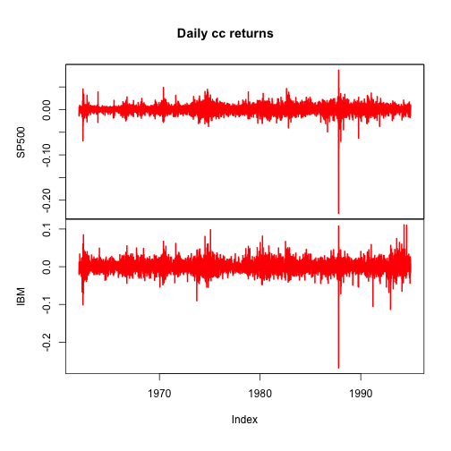
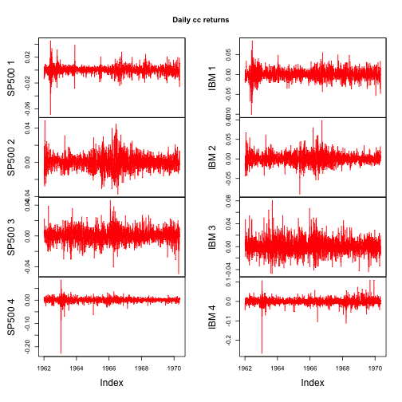
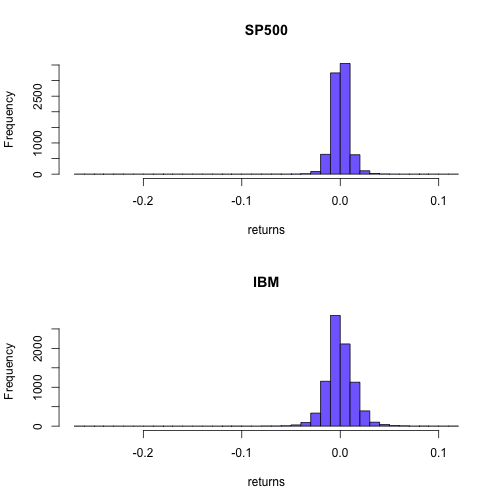
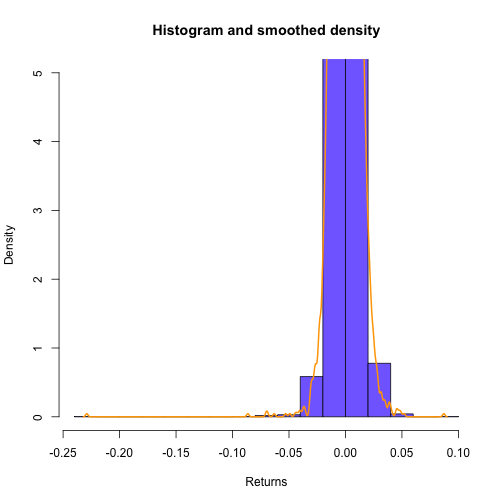
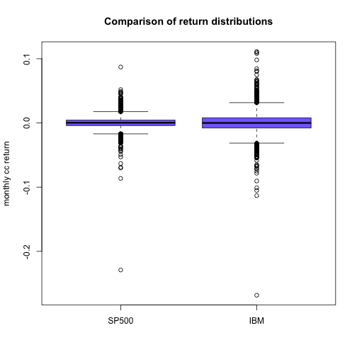

# Atividade 1 - Análise estatística

## Carregando os arquivos do Yahoo! Finance

Vamos carregar as séries de preços de fechamento ajustados de ambas as séries em uma única estrutura de dados de séries temporais chamada `act1Prices.z`.
Note que utilizamos o pacote `zoo`, logo é necessário tê-lo carregado previamente.


```r
# SP500
sp500.df <- read.csv('data/GSPC-1962-1994.daily.csv', header=TRUE, stringsAsFactors=FALSE)
sp500.df$Date <- as.Date(sp500.df$Date)
sp500.df <- sp500.df[order(sp500.df$Date),]
sp500Prices.df <- sp500.df[, "Adj.Close", drop=FALSE]
rownames(sp500Prices.df) <- sp500.df[, "Date"]
colnames(sp500Prices.df) <- c("SP500")
sp500.prices <- as.zoo(sp500Prices.df)
index(sp500.prices) <- sp500.df[, "Date"]
head(sp500.prices)
```

```
##            SP500
## 1962-01-03 71.13
## 1962-01-04 70.64
## 1962-01-05 69.66
## 1962-01-08 69.12
## 1962-01-09 69.15
## 1962-01-10 68.96
```

```r
# IBM
ibm.df <- read.csv('data/IBM-1962-1994.daily.csv', header=TRUE, stringsAsFactors=FALSE)
ibm.df$Date <- as.Date(ibm.df$Date)
ibm.df <- ibm.df[order(ibm.df$Date),]
ibmPrices.df <- ibm.df[, "Adj.Close", drop=FALSE]
rownames(ibmPrices.df) <- ibm.df[, "Date"]
colnames(ibmPrices.df) <- c("IBM")
ibm.prices <- as.zoo(ibmPrices.df)
index(ibm.prices) <- ibm.df[, "Date"]
head(ibm.prices)
```

```
##             IBM
## 1962-01-03 2.56
## 1962-01-04 2.54
## 1962-01-05 2.49
## 1962-01-08 2.44
## 1962-01-09 2.47
## 1962-01-10 2.47
```

```r
# Merging series
act1Prices.z <- merge(sp500.prices, ibm.prices)
head(act1Prices.z)
```

```
##            SP500  IBM
## 1962-01-03 71.13 2.56
## 1962-01-04 70.64 2.54
## 1962-01-05 69.66 2.49
## 1962-01-08 69.12 2.44
## 1962-01-09 69.15 2.47
## 1962-01-10 68.96 2.47
```

```r
# Calculando retornos
act1Returns.z <- diff(log(act1Prices.z))
plot(act1Returns.z, col="red", lwd=2, main="Daily cc returns")
```

 

Bem, calculados os retornos, vamos dividir as séries em 4 partes iguais.


```r
# Quantidade de linhas
n = nrow(sp500.prices)
# SP500
dim(sp500.prices) <- c(n/4, 4)
```

```
## Warning in `dim<-.zoo`(`*tmp*`, value = c(2074, 4)): setting this dimension
## may lead to an invalid zoo object
```

```r
colnames(sp500.prices) <- paste("SP500", 1:4)
head(sp500.prices)
```

```
##            SP500 1 SP500 2 SP500 3 SP500 4
## 1962-01-03   71.13   79.44   98.44  234.41
## 1962-01-04   70.64   78.60   99.08  236.68
## 1962-01-05   69.66   77.85   99.54  235.85
## 1962-01-08   69.12   76.53  100.00  235.48
## 1962-01-09   69.15   75.44  100.68  235.91
## 1962-01-10   68.96   76.90  100.66  235.37
```

```r
# IBM
dim(ibm.prices) <- c(n/4, 4)
```

```
## Warning in `dim<-.zoo`(`*tmp*`, value = c(2074, 4)): setting this dimension
## may lead to an invalid zoo object
```

```r
colnames(ibm.prices) <- paste("IBM", 1:4)
head(ibm.prices)
```

```
##            IBM 1 IBM 2 IBM 3 IBM 4
## 1962-01-03  2.56  4.98  7.16 19.21
## 1962-01-04  2.54  4.90  7.17 19.11
## 1962-01-05  2.49  4.84  7.24 18.29
## 1962-01-08  2.44  4.72  7.31 18.53
## 1962-01-09  2.47  4.60  7.37 18.29
## 1962-01-10  2.47  4.64  7.32 18.12
```

```r
# Merging series
act1partsPrices.z <- merge(sp500.prices[,1:4], ibm.prices[,1:4])
head(act1partsPrices.z)
```

```
##            SP500 1 SP500 2 SP500 3 SP500 4 IBM 1 IBM 2 IBM 3 IBM 4
## 1962-01-03   71.13   79.44   98.44  234.41  2.56  4.98  7.16 19.21
## 1962-01-04   70.64   78.60   99.08  236.68  2.54  4.90  7.17 19.11
## 1962-01-05   69.66   77.85   99.54  235.85  2.49  4.84  7.24 18.29
## 1962-01-08   69.12   76.53  100.00  235.48  2.44  4.72  7.31 18.53
## 1962-01-09   69.15   75.44  100.68  235.91  2.47  4.60  7.37 18.29
## 1962-01-10   68.96   76.90  100.66  235.37  2.47  4.64  7.32 18.12
```

```r
act1partsReturns.z <- diff(log(act1partsPrices.z))
plot(act1partsReturns.z, col="red", lwd=1, main="Daily cc returns")
```

 


## Estatísticas em retornos simples

Infelizmente uma coisa *tricky*, as funções do core do R não funcionam adequadamente com objetos `zoo` de séries temporais, logo, devemos fazer uma cópia do objeto em forma de matriz.


```r
# Serie completa
ret.mat <- coredata(act1Returns.z)
class(ret.mat)
```

```
## [1] "matrix"
```

```r
colnames(ret.mat)
```

```
## [1] "SP500" "IBM"
```

```r
head(ret.mat)
```

```
##              SP500          IBM
## [1,] -0.0069126324 -0.007843177
## [2,] -0.0139702914 -0.019881371
## [3,] -0.0077821404 -0.020284671
## [4,]  0.0004339336  0.012220111
## [5,] -0.0027514318  0.000000000
## [6,]  0.0059278710  0.012072581
```

```r
# Para as partes
retparts.mat <- coredata(act1partsReturns.z)
```

Note que a estrutura de ordenação e colunas é mantida.


```r
# Estatisticas para as series completas
apply(ret.mat, 2, mean)
```

```
##        SP500          IBM 
## 0.0002247264 0.0002085588
```

```r
apply(ret.mat, 2, sd)
```

```
##       SP500         IBM 
## 0.008813746 0.014511225
```

```r
myacf <- function(x) { acf(x, lag.max=1, type="correlation", plot=FALSE) }
apply(ret.mat, 2, myacf)
```

```
## $SP500
## 
## Autocorrelations of series 'x', by lag
## 
##     0     1 
## 1.000 0.125 
## 
## $IBM
## 
## Autocorrelations of series 'x', by lag
## 
##      0      1 
##  1.000 -0.005
```

```r
# Para as partes
apply(retparts.mat, 2, mean)
```

```
##       SP500 1       SP500 2       SP500 3       SP500 4         IBM 1 
##  5.566338e-05  9.990556e-05  4.192965e-04  3.239473e-04  3.200254e-04 
##         IBM 2         IBM 3         IBM 4 
##  1.717667e-04  4.957656e-04 -1.376888e-04
```

```r
apply(retparts.mat, 2, sd)
```

```
##     SP500 1     SP500 2     SP500 3     SP500 4       IBM 1       IBM 2 
## 0.006486956 0.008745287 0.008827790 0.010692630 0.013117351 0.013967302 
##       IBM 3       IBM 4 
## 0.013715575 0.016929063
```

```r
apply(retparts.mat, 2, myacf)
```

```
## $`SP500 1`
## 
## Autocorrelations of series 'x', by lag
## 
##     0     1 
## 1.000 0.183 
## 
## $`SP500 2`
## 
## Autocorrelations of series 'x', by lag
## 
##     0     1 
## 1.000 0.268 
## 
## $`SP500 3`
## 
## Autocorrelations of series 'x', by lag
## 
##     0     1 
## 1.000 0.097 
## 
## $`SP500 4`
## 
## Autocorrelations of series 'x', by lag
## 
##     0     1 
## 1.000 0.027 
## 
## $`IBM 1`
## 
## Autocorrelations of series 'x', by lag
## 
##     0     1 
## 1.000 0.034 
## 
## $`IBM 2`
## 
## Autocorrelations of series 'x', by lag
## 
##     0     1 
## 1.000 0.067 
## 
## $`IBM 3`
## 
## Autocorrelations of series 'x', by lag
## 
##      0      1 
##  1.000 -0.077 
## 
## $`IBM 4`
## 
## Autocorrelations of series 'x', by lag
## 
##     0     1 
##  1.00 -0.03
```

## Histogramas


```r
IBM.hist = hist(ret.mat[,2], plot=FALSE, breaks=30)
par(mfrow=c(2,1))
    hist(ret.mat[,1], main="SP500", col="slateblue1", xlab="returns", breaks=IBM.hist$breaks)
    hist(ret.mat[,2], main="IBM", col="slateblue1", xlab="returns", breaks=IBM.hist$breaks)
```

 

```r
par(mfrow=c(1,1))
```

### Histogramas *alisados* - `density`


```r
SP500.density = density(ret.mat[,1])
hist(ret.mat[,1], main="Histogram and smoothed density", col="slateblue1", probability=TRUE, ylim=c(0,5), xlab="Returns")
points(SP500.density, type="l", col="orange", lwd=2)
```

 


## Boxplot


```r
boxplot(ret.mat[,1], ret.mat[,2], names=c("SP500","IBM"), outchar=TRUE, col="slateblue1", main="Comparison of return distributions", ylab="monthly cc return")
```

 


## Assimetria e kurtose

As funções *skewness* e *kurtose* pertencem ao pacote `PerformanceAnalytics`.


```r
# Estatisticas para as series completas
apply(ret.mat, 2, skewness)
```

```
##      SP500        IBM 
## -2.1940742 -0.6043265
```

```r
apply(ret.mat, 2, kurtosis)
```

```
##    SP500      IBM 
## 60.28919 18.34358
```

```r
# Para as partes
apply(retparts.mat, 2, skewness)
```

```
##     SP500 1     SP500 2     SP500 3     SP500 4       IBM 1       IBM 2 
## -0.48180865  0.26893731  0.07840346 -5.02755742 -0.25419844  0.36540289 
##       IBM 3       IBM 4 
##  0.42734872 -1.81069069
```

```r
apply(retparts.mat, 2, kurtosis)
```

```
##    SP500 1    SP500 2    SP500 3    SP500 4      IBM 1      IBM 2 
##  10.142764   2.166363   1.865619 107.822154   4.436747   3.762453 
##      IBM 3      IBM 4 
##   1.841794  35.061310
```
