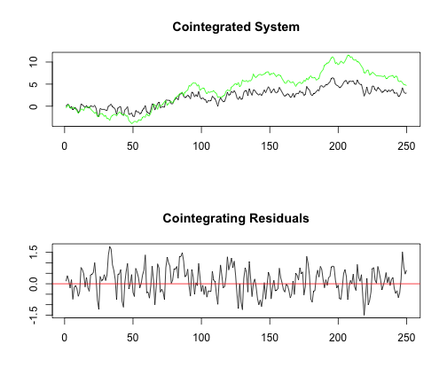

---

title       : Testes de cointegração  
subtitle    : Avaliando a existência de relação de conintegração entre séries temporais  
author      : Wilson Freitas  
job         : Quant  
framework   : io2012        # {io2012, html5slides, shower, dzslides, ...}  
highlighter : highlight.js  # {highlight.js, prettify, highlight}  
hitheme     : tomorrow      #   
widgets     : [mathjax]     # {mathjax, quiz, bootstrap}  
mode        : selfcontained # {standalone, draft}  

---
## Recursos

- [index.Rmd](index.Rmd)

--- .segue .dark .nobackground
## Teste de Engle & Granger (EG)

--- &smaller
## Teste de Engle & Granger

- Objetivo: testar a existência de cointegração entre duas séries temporais $I(1)$ ($y_{1,t}$ e $y_{2,t}$)
- Rodar a regressão (MQO)
$$ y_{1,t} = \alpha + \beta y_{2,t} + \varepsilon_{1,t} $$
- Realizar teste de raiz unitária (RU) para os resíduos $\hat{\varepsilon}_{1,t} = y_{1,t} - \hat{\alpha} - \hat{\beta} y_{2,t}$ sob o seguinte modelo
$$
\hat{\varepsilon}_{1,t} = \phi \hat{\varepsilon}_{1,t-1} + \eta_t
$$
- Onde as seguintes hipóteses devem ser testadas.
$$
\begin{split}
H_0 &: \hat{\varepsilon}_{1,t}\,\textrm{tem RU} \longrightarrow \textrm{não há cointegração} \\
H_1 &: \hat{\varepsilon}_{1,t}\,\textrm{não tem RU} \longrightarrow \textrm{há cointegração}
\end{split}
$$
- O teste de raiz unitária sobre os resíduos deve ser realizado **sem drift** e **sem tendência deterministica**.
- Os resíduos $\hat{\varepsilon_{1,t}}$ necessariamente terão média nula, exceto nos casos em que a amostra é pequena e $\hat{\varepsilon_{1,t}}$ possui um valor absolute alto.

---
## Teste de Engle & Granger (valores críticos)

- Os valores críticos do teste RU para os resíduos são **diferentes** dos utilizados no teste RU-ADF.
- Isso acontece porque os testes RU são realizados sobre uma série temporal observada e aqui o teste é realizado sobre uma série temporal estimada, obtida através do processo de estimação de $\hat{\alpha}$ e $\hat{\beta}$.
- Se tivessemos os valores **reais** de $\alpha$ e $\beta$ poderiamos utilizá-los para obter os resíduos e assim executar o teste de raiz unitária sobre eles utilizando os mesmos valores críticos utilizados no teste ADF.
- Felizmente MacKinnon obteve estes valores críticos para os testes de cointegração (MacKinnon, J.G. (2010), "Critical Values for Cointegration Tests," Queen’s Economics Department Working Paper No. 1227).

--- &smaller
## Teste de Engle & Granger (particularidades)

- Consideremos o processo gerador: $z_{t} = \alpha + \beta z_{t-1} + \eta_{t}$.
- Quando o processo gerador da série temporal é sem drift, $\alpha = 0$, a estatística do teste RU tem uma distribuição de Dickey-Fuller (DF).
- Quando $\alpha \neq 0$ a estatística do teste RU é $N(0,1)$, assintoticamente, e em amostras pequenas (finitas) esta distribuição *talvez* possa ser aproximada da distribuição de DF.

***

- No teste de EG a distribuição da estatística do teste de RU depende de $\alpha$ (do modelo $y_{1,t} = \alpha + \beta y_{2,t} + \varepsilon_{1,t}$), no entanto, as tabelas assumem $\alpha = 0$ e isso pode gerar erros quando $\alpha \neq 0$.
- Uma forma de evitar a dependência em $\alpha$ na distribuição da estatística de teste é introduzir um termo de tendência deterministica na regressão
$$
y_{1,t} = \alpha_0 t + \alpha + \beta y_{2,t} + \varepsilon_{1,t}
$$
- Assim a distribuição da estatística torna-se invariante a $\alpha$ embora seja diferente do caso sem a tendência deterministica.
- Dessa maneira, temos 2 variantes para o teste de EG: **com drift** e **com tendência deterministica**.

--- &smaller
## Teste de Engle & Granger

### Curiosidades
- Qualquer variável pode ser escolhida como regressor, podemos escolher tanto $y_{1,t}$ quanto $y_{2,t}$.
- No limite o teste pode ser realizado com ambas as variáveis, separadamente, para tornar a análise mais robusta.
- Este teste pode ser realizado ainda para avaliar a existência de cointegração em $N$ séries temporais simultâneamente.

***

### Dúvidas
- Quando faz sentido utilizar a tendência deterministica?
- Engle & Yoo (1991) argumentam que existem boas razões para introduzir tendência deterministica.
- É importante notar que essa diferença na modelagem é referente a regressão na qual os resíduos são estimados e sob os quais o teste de RU é executado.


--- &smaller
Gerando séries claramente cointegradas


```r
set.seed(12345)
e1 <- rnorm(250, mean = 0, sd = 0.5)
e2 <- rnorm(250, mean = 0, sd = 0.5)
u.ar3 <- arima.sim(model = list(ar = c(0.6, -0.2, 0.1)), n = 250, innov = e1)
y2 <- cumsum(e2)
y1 <- u.ar3 + 0.5 * y2
```


<p style="text-align:center;">
	
</p>

--- &smaller
### Passo 1
Estimar regressão entre variáveis `y1` e `y2`.


```r
lr <- lm(y1 ~ y2)
summary(lr)
```

```
## 
## Call:
## lm(formula = y1 ~ y2)
## 
## Residuals:
##     Min      1Q  Median      3Q     Max 
## -1.5557 -0.4407  0.0053  0.4403  1.5273 
## 
## Coefficients:
##             Estimate Std. Error t value Pr(>|t|)    
## (Intercept)  0.19143    0.05276    3.63  0.00035 ***
## y2           0.48218    0.00939   51.36  < 2e-16 ***
## ---
## Signif. codes:  0 '***' 0.001 '**' 0.01 '*' 0.05 '.' 0.1 ' ' 1 
## 
## Residual standard error: 0.608 on 248 degrees of freedom
## Multiple R-squared: 0.914,	Adjusted R-squared: 0.914 
## F-statistic: 2.64e+03 on 1 and 248 DF,  p-value: <2e-16
```


--- &vcenter
### Resíduos da regressão

 


--- &smaller
### Passo 2
Testar a existência de raiz unitária nos resíduos.


```r
library(urca)
ur <- ur.df(y = residuals(lr), lags = 4, type = "none", selectlags = "BIC")
ur@teststat
```

```
##             tau1
## statistic -9.809
```


Valores críticos


```
##        1pct   5pct  10pct
## tau1 -3.943 -3.362 -3.063
```


<ul class="build">
	<li class="red3">Não podemos aceitar a hipótese nula de existência de raiz unitária, portanto, não podemos rejeitar a hipótese de que as séries são <strong>cointegradas</strong>.</li>
</ul>

--- &vcenter
### Resíduos do teste de raiz unitária

 


--- &thanks
## Testes de cointegração
