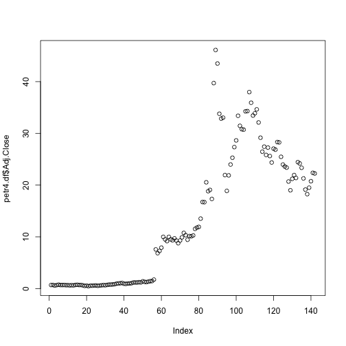
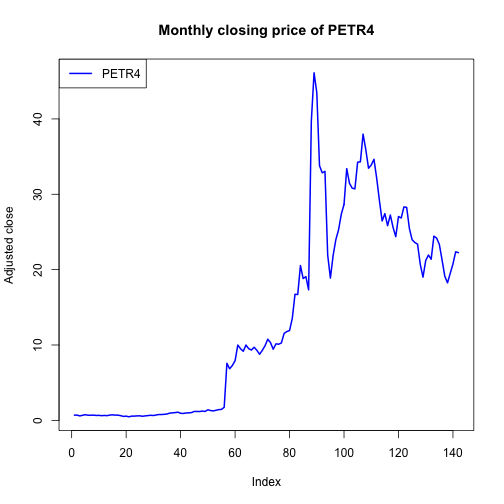
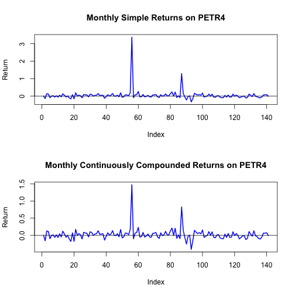
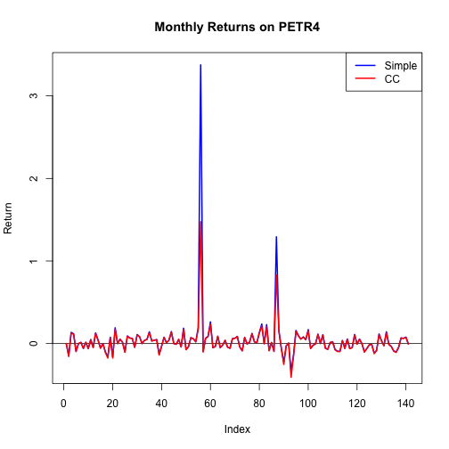
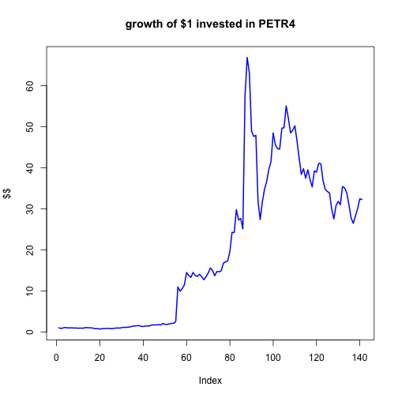
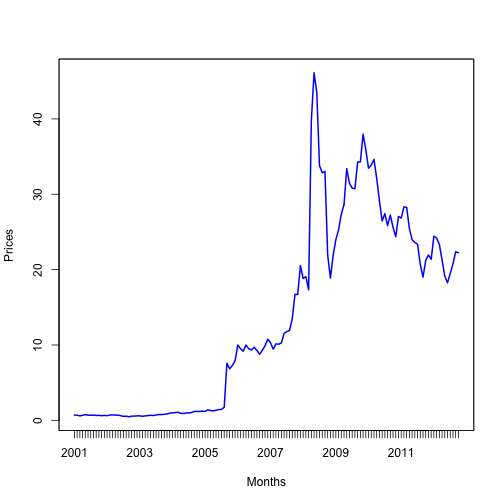
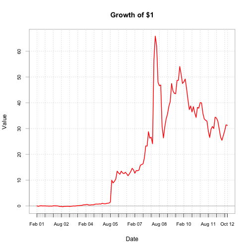
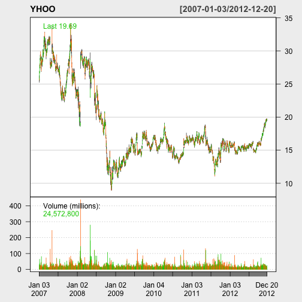

---

title       : Computing Returns  
subtitle    :  
author      : Wilson Freitas  
job         : Quant  
framework   : io2012        # {io2012, html5slides, shower, dzslides, ...}  
highlighter : highlight.js  # {highlight.js, prettify, highlight}  
hitheme     : tomorrow      #   
widgets     : [mathjax]     # {mathjax, quiz, bootstrap}  
mode        : selfcontained # {standalone, draft, selfcontained}  

---


## download resources

- [PETR4.SA.csv](data/PETR4.SA.csv) file
- [index.Rmd](index.Rmd) source file

---

## loading time series into data.frame


```r
petr4.df = read.csv(file = "data/PETR4.SA.csv", header = TRUE, stringsAsFactors = FALSE)
class(petr4.df)
```

```
## [1] "data.frame"
```

```r
str(petr4.df)
```

```
## 'data.frame':	142 obs. of  7 variables:
##  $ Date     : chr  "2001-01-03" "2001-02-01" "2001-03-01" "2001-04-02" ...
##  $ Open     : num  5.89 6.81 6.87 5.62 6.75 7.47 6.74 6.78 6.84 6.35 ...
##  $ High     : num  7.04 7.35 7.22 6.82 7.56 7.86 6.85 7.12 7.38 6.91 ...
##  $ Low      : num  5.82 6.62 5.7 5.57 6.62 6.49 6.25 6.43 6 6.01 ...
##  $ Close    : num  6.81 6.86 5.87 6.68 7.47 6.75 6.78 6.88 6.41 6.49 ...
##  $ Volume   : int  41736900 30358200 37962600 34395000 27670200 30358800 38772600 28004400 40997500 33448400 ...
##  $ Adj.Close: num  0.69 0.69 0.59 0.67 0.75 0.68 0.68 0.69 0.65 0.66 ...
```


---

## data.frame `head`


```r
head(petr4.df)
```

```
##         Date Open High  Low Close   Volume Adj.Close
## 1 2001-01-03 5.89 7.04 5.82  6.81 41736900      0.69
## 2 2001-02-01 6.81 7.35 6.62  6.86 30358200      0.69
## 3 2001-03-01 6.87 7.22 5.70  5.87 37962600      0.59
## 4 2001-04-02 5.62 6.82 5.57  6.68 34395000      0.67
## 5 2001-05-03 6.75 7.56 6.62  7.47 27670200      0.75
## 6 2001-06-01 7.47 7.86 6.49  6.75 30358800      0.68
```


---

## data.frame `tail`


```r
tail(petr4.df)
```

```
##           Date  Open  High   Low Close   Volume Adj.Close
## 137 2012-05-02 21.26 22.25 18.08 19.13 27983000     19.13
## 138 2012-06-01 18.53 20.15 17.42 18.25 30203300     18.25
## 139 2012-07-02 18.10 20.31 17.97 19.50 26911600     19.50
## 140 2012-08-01 19.50 21.88 18.83 20.75 25709700     20.75
## 141 2012-09-03 20.77 23.84 20.28 22.37 23399800     22.37
## 142 2012-10-01 22.33 23.10 22.02 22.25 21491800     22.25
```


---

## data.frame properties


```r
colnames(petr4.df)
```

```
## [1] "Date"      "Open"      "High"      "Low"       "Close"     "Volume"   
## [7] "Adj.Close"
```

```r
class(petr4.df$Date)
```

```
## [1] "character"
```

```r
class(petr4.df$Adj.Close)
```

```
## [1] "numeric"
```


---

## indexing data.frame - always returns a vector


```r
petr4.df[1:5, "Adj.Close"]  # using column name
```

```
## [1] 0.69 0.69 0.59 0.67 0.75
```

```r
petr4.df[1:5, 7]  # using column index
```

```
## [1] 0.69 0.69 0.59 0.67 0.75
```

```r
petr4.df$Adj.Close[1:5]  # using attribite reffering to column
```

```
## [1] 0.69 0.69 0.59 0.67 0.75
```


---

## `drop=FALSE` keeps data.frame structure


```r
petr4.df[1:5, "Adj.Close", drop = FALSE]
```

```
##   Adj.Close
## 1      0.69
## 2      0.69
## 3      0.59
## 4      0.67
## 5      0.75
```


---

## extracting data.frame subsets isn't easy


```r
c(which(petr4.df$Date == "2010-01-04"), which(petr4.df == "2010-07-01"))
```

```
## [1] 109 115
```

```r
petr4.df[which(petr4.df == "2010-01-04"):which(petr4.df == "2010-07-01"), ]
```

```
##           Date  Open  High   Low Close   Volume Adj.Close
## 109 2010-01-04 36.95 37.50 33.51 34.17 19068700     33.45
## 110 2010-02-01 34.29 34.89 30.72 34.61 19589300     33.88
## 111 2010-03-01 34.82 37.48 34.12 35.39 21152500     34.64
## 112 2010-04-01 35.66 36.41 31.90 32.80 20999100     32.11
## 113 2010-05-03 32.55 32.63 26.00 29.60 23845800     29.16
## 114 2010-06-01 29.00 30.38 26.71 26.86 17958000     26.46
## 115 2010-07-01 27.11 28.28 26.31 27.85 12439600     27.43
```


---

## defining rownames


```r
petr4Prices.df = petr4.df[, "Adj.Close", drop = FALSE]
rownames(petr4Prices.df) = petr4.df$Date
head(petr4Prices.df)
```

```
##            Adj.Close
## 2001-01-03      0.69
## 2001-02-01      0.69
## 2001-03-01      0.59
## 2001-04-02      0.67
## 2001-05-03      0.75
## 2001-06-01      0.68
```


---

## indexing by rownames


```r
petr4Prices.df["2010-01-04", 1]
```

```
## [1] 33.45
```

```r
petr4Prices.df["2010-01-04", 1, drop = FALSE]
```

```
##            Adj.Close
## 2010-01-04     33.45
```


---

## plotting data


```r
plot(petr4.df$Adj.Close)
```

 


---


```r
plot(petr4.df$Adj.Close, type = "l", col = "blue", lwd = 2, ylab = "Adjusted close", 
    main = "Monthly closing price of PETR4")
legend(x = "topleft", legend = "PETR4", lty = 1, lwd = 2, col = "blue")
```

 


---

## simple returns

$$
R_t = \frac{P_t - P_{t-1}}{P_{t-1}}
$$


```r
n = nrow(petr4Prices.df)  # number of rows
petr4.ret = (petr4Prices.df[2:n, 1] - petr4Prices.df[1:(n - 1), 1])/petr4Prices.df[1:(n - 
    1), 1]
head(petr4.ret)
```

```
## [1]  0.00000 -0.14493  0.13559  0.11940 -0.09333  0.00000
```


---

### `petr4.ret` is not a data.frame object


```r
class(petr4.ret)
```

```
## [1] "numeric"
```

```r
names(petr4.ret) = rownames(petr4Prices.df)[2:n]  # adding names to a vector
head(petr4.ret)
```

```
## 2001-02-01 2001-03-01 2001-04-02 2001-05-03 2001-06-01 2001-07-02 
##    0.00000   -0.14493    0.13559    0.11940   -0.09333    0.00000
```

---

### simple returns as data.frame objects - use `drop=FALSE`


```r
petr4.ret.df = (petr4Prices.df[2:n, 1, drop = FALSE] - petr4Prices.df[1:(n - 1), 
    1, drop = FALSE])/petr4Prices.df[1:(n - 1), 1, drop = FALSE]
head(petr4.ret.df)
```

```
##            Adj.Close
## 2001-02-01   0.00000
## 2001-03-01  -0.14493
## 2001-04-02   0.13559
## 2001-05-03   0.11940
## 2001-06-01  -0.09333
## 2001-07-02   0.00000
```


---

## continuously compounded returns

$$
r_t = \log(1 + R_t) = \log \left( \frac{P_t}{P_{t-1}} \right)
$$

### easy way


```r
petr4.ccret = log(1 + petr4.ret)
head(petr4.ccret)
```

```
## 2001-02-01 2001-03-01 2001-04-02 2001-05-03 2001-06-01 2001-07-02 
##    0.00000   -0.15657    0.12716    0.11280   -0.09798    0.00000
```

---

### alternatively


```r
petr4.ccret = log(petr4Prices.df[2:n, 1]) - log(petr4Prices.df[1:(n - 1), 1])
names(petr4.ccret) = rownames(petr4Prices.df)[2:n]
head(petr4.ccret)
```

```
## 2001-02-01 2001-03-01 2001-04-02 2001-05-03 2001-06-01 2001-07-02 
##    0.00000   -0.15657    0.12716    0.11280   -0.09798    0.00000
```


---

## comparing returns


```r
head(cbind(petr4.ret, petr4.ccret))
```

```
##            petr4.ret petr4.ccret
## 2001-02-01   0.00000     0.00000
## 2001-03-01  -0.14493    -0.15657
## 2001-04-02   0.13559     0.12716
## 2001-05-03   0.11940     0.11280
## 2001-06-01  -0.09333    -0.09798
## 2001-07-02   0.00000     0.00000
```


---

## plotting simple and continuous returns


```r
par(mfrow = c(2, 1))  # split screen into 2 rows and 1 column
plot(petr4.ret, main = "Monthly Simple Returns on PETR4", ylab = "Return", type = "l", 
    col = "blue", lwd = 2)
abline(h = 0)
plot(petr4.ccret, main = "Monthly Continuously Compounded Returns on PETR4", ylab = "Return", 
    type = "l", col = "blue", lwd = 2)
abline(h = 0)
par(mfrow = c(1, 1))  # reset the screen to 1 row and 1 column
```


---

 


---

## on the same graph


```r
plot(petr4.ret, main = "Monthly Returns on PETR4", ylab = "Return", type = "l", col = "blue", 
    lwd = 2)
abline(h = 0)
lines(petr4.ccret, col = "red", lwd = 2)
legend(x = "topright", legend = c("Simple", "CC"), lty = 1, lwd = 2, col = c("blue", 
    "red"))
```


---

 


---


```r
petr4.gret = 1 + petr4.ret  # compute gross returns
petr4.fv = cumprod(petr4.gret)  # compute future values
plot(petr4.fv, type = "l", col = "blue", lwd = 2, ylab = "$$", main = "growth of $1 invested in PETR4")
```

 


---

## could life be easier?

R has a large number of packages that make life easier.

- [PerformanceAnalytics](http://cran.fhcrc.org/web/packages/PerformanceAnalytics/index.html): Econometric tools for performance and risk analysis
- [quantmod](http://cran.r-project.org/web/packages/quantmod/index.html): functions for quantitative modelling in finance
- [zoo](http://cran.fhcrc.org/web/packages/zoo/index.html): Z's ordered observations
- [xts](http://cran.fhcrc.org/web/packages/xts/index.html): Extensible time series
- [tseries](http://cran.fhcrc.org/web/packages/tseries/index.html): Time series analysis and computational finance
- [fPortfolio](http://cran.r-project.org/web/packages/fPortfolio/index.html): Portfolio Selection and Optimization
- [mvtnorm](http://cran.fhcrc.org/web/packages/mvtnorm/index.html): Multivariate normal and multivariate t distribution

---

## CRAN

<iframe src='http://cran.r-project.org/index.html' height="600px"></iframe>

---

## CRAN Task Views

<iframe src='http://cran.r-project.org/web/views/' height="600px"></iframe>

---

## Finance Task View

<iframe src='http://cran.r-project.org/web/views/Finance.html' height="600px"></iframe>

---

## PerformanceAnalytics package


```r
library(PerformanceAnalytics)
```

```
## Loading required package: zoo
```

```
## Attaching package: 'zoo'
```

```
## The following object(s) are masked from 'package:base':
## 
## as.Date, as.Date.numeric
```

```
## Loading required package: xts
```

```
## Attaching package: 'PerformanceAnalytics'
```

```
## The following object(s) are masked from 'package:graphics':
## 
## legend
```


---


```r
dates.petr4 = as.yearmon(petr4.df$Date, format = "%Y-%m-%d")  # convert to month-year
head(dates.petr4)
```

```
## [1] "Jan 2001" "Feb 2001" "Mar 2001" "Apr 2001" "May 2001" "Jun 2001"
```

```r
petr4.z = zoo(x = petr4.df$Adj.Close, order.by = dates.petr4)  # create zoo object
class(petr4.z)
```

```
## [1] "zoo"
```

```r
head(petr4.z)
```

```
## Jan 2001 Feb 2001 Mar 2001 Apr 2001 May 2001 Jun 2001 
##     0.69     0.69     0.59     0.67     0.75     0.68
```


---


```r
plot(petr4.z, lwd = 2, col = "blue", ylab = "Prices", xlab = "Months")
```

 


---

## subsetting zoo objects


```r
petr4.z[as.yearmon(c("Jan 2010", "Jan 2011"))]
```

```
## Jan 2010 Jan 2011 
##    33.45    26.85
```

```r
window(petr4.z, start = as.yearmon("Jan 2010"), end = as.yearmon("Jan 2011"))
```

```
## Jan 2010 Feb 2010 Mar 2010 Apr 2010 May 2010 Jun 2010 Jul 2010 Aug 2010 
##    33.45    33.88    34.64    32.11    29.16    26.46    27.43    25.83 
## Sep 2010 Oct 2010 Nov 2010 Dec 2010 Jan 2011 
##    27.25    25.62    24.37    27.05    26.85
```


---

## computing returns made simple

### core (no-package dependency)


```r
petr4Ret.z = diff(petr4.z)/lag(petr4.z, k = -1)
petr4Retcc.z = diff(log(petr4.z))
head(merge(petr4Ret.z, petr4Retcc.z))
```

```
##          petr4Ret.z petr4Retcc.z
## Feb 2001    0.00000      0.00000
## Mar 2001   -0.14493     -0.15657
## Apr 2001    0.13559      0.12716
## May 2001    0.11940      0.11280
## Jun 2001   -0.09333     -0.09798
## Jul 2001    0.00000      0.00000
```


---

### with PerformanceAnalytics functions


```r
petr4Ret.z = CalculateReturns(petr4.z, method = "simple")
petr4Retcc.z = CalculateReturns(petr4.z, method = "compound")
head(merge(petr4Ret.z, petr4Retcc.z))
```

```
##          e1 petr4Retcc.z
## Jan 2001  0           NA
## Feb 2001  0      0.00000
## Mar 2001  0     -0.15657
## Apr 2001  0      0.12716
## May 2001  0      0.11280
## Jun 2001  0     -0.09798
```


---


```r
chart.CumReturns(petr4Ret.z, lwd = 2, col = "red", main = "Growth of $1")
```

 


---

## quantmod package


```r
library(quantmod)
```

```
## Loading required package: Defaults
```

```
## Loading required package: TTR
```

```
## Loading required package: methods
```


---


```r
getSymbols("YHOO")  # fetching time series as xts object
```

```
## [1] "YHOO"
```

```r
class(YHOO)
```

```
## [1] "xts" "zoo"
```

```r
colnames(YHOO)
```

```
## [1] "YHOO.Open"     "YHOO.High"     "YHOO.Low"      "YHOO.Close"   
## [5] "YHOO.Volume"   "YHOO.Adjusted"
```


---


```r
start(YHOO)  # first date
```

```
## [1] "2007-01-03"
```

```r
end(YHOO)  # last date
```

```
## [1] "2012-12-20"
```


---


```r
head(YHOO)
```

```
##            YHOO.Open YHOO.High YHOO.Low YHOO.Close YHOO.Volume YHOO.Adjusted
## 2007-01-03     25.85     26.26    25.26      25.61    26352700         25.61
## 2007-01-04     25.64     26.92    25.52      26.85    32512200         26.85
## 2007-01-05     26.70     27.87    26.66      27.74    64264600         27.74
## 2007-01-08     27.70     28.04    27.43      27.92    25713700         27.92
## 2007-01-09     28.00     28.05    27.41      27.58    25621500         27.58
## 2007-01-10     27.48     28.92    27.44      28.70    40240000         28.70
```


---


```r
chartSeries(YHOO, theme = chartTheme("white"))
```

 


--- &thanks
## Computing Returns
