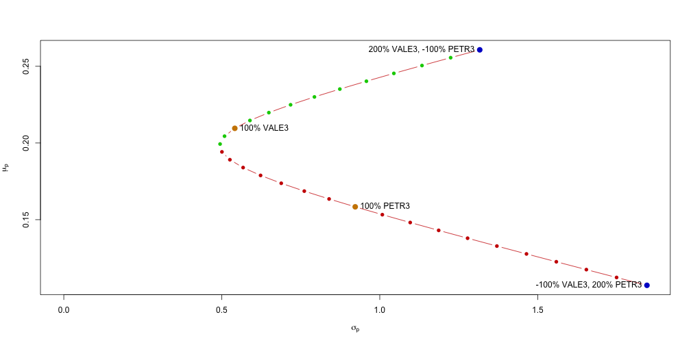
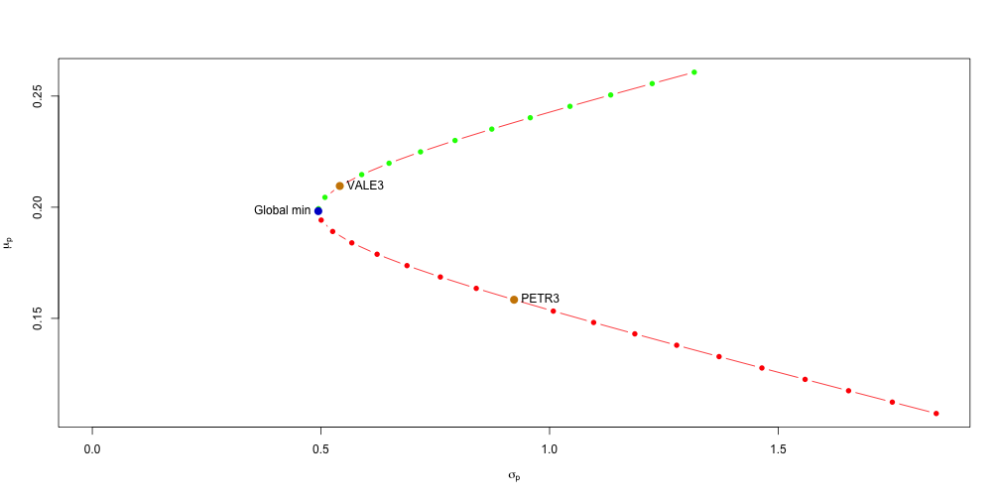
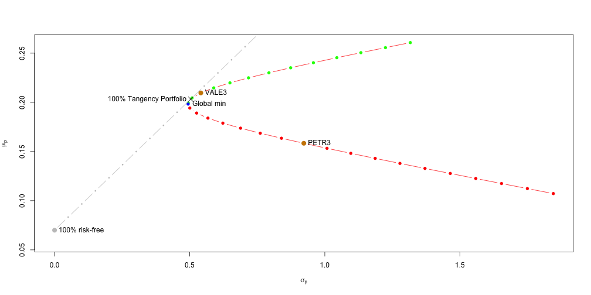
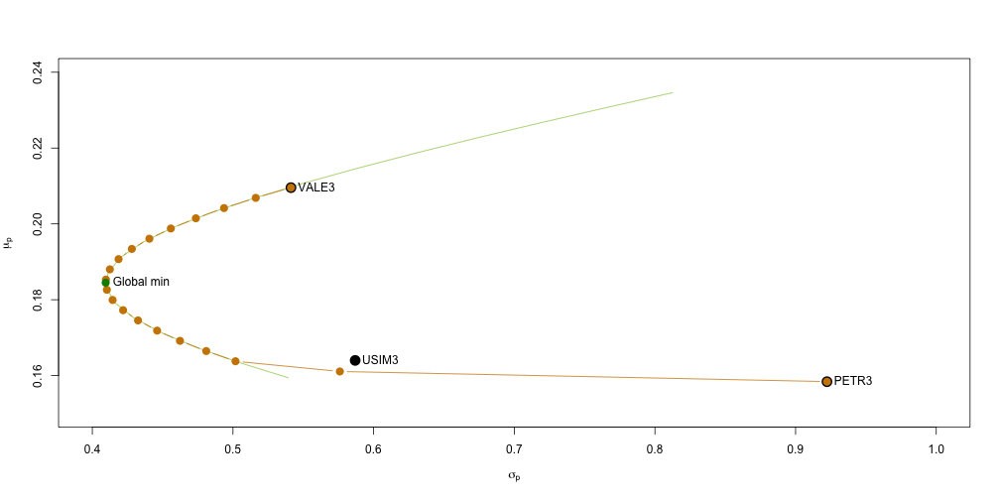

---

title       : Teoria de carteiras de Markowitz  
subtitle    :   
author      : Wilson Freitas  
job         : Quant  
framework   : io2012        # {io2012, html5slides, shower, dzslides, ...}  
highlighter : highlight.js  # {highlight.js, prettify, highlight}  
hitheme     : tomorrow      #   
widgets     : [mathjax]     # {mathjax, quiz, bootstrap}  
mode        : selfcontained # {standalone, draft}  

---

<!-- 
VALE3: jan 2000 - nov 2012
USIM5: jan 2000 - nov 2012
PETR3: jan 2000 - nov 2012
PETR3: jan 2000 - nov 2012

*BBDC3: jan 2000 - nov 2012
PETR4: jan 2000 - nov 2012
USIM3: jan 2000 - nov 2012

VALE5: jan 2003 - nov 2012
ITUB4: jan 2001 - nov 2012
-->

## download de recursos

- [index.Rmd](index.Rmd): código fonte da apresentação
- [portfolio.r](scripts/portfolio.r): conjunto de funções em R para cálculo de fronteira eficiente de carteiras desenvolvido por Eric Zivot
- [getReturns.r](scripts/getReturns.r): funções para facilitar o cálculo de retorno de séries temporais carregadas de arquivos do Yahoo! Finance
- [PETR3.monthly.raw.csv](data/PETR3.monthly.raw.csv),  [PETR4.monthly.raw.csv](data/PETR4.monthly.raw.csv)
- [VALE3.monthly.raw.csv](data/VALE3.monthly.raw.csv),  [VALE5.monthly.raw.csv](data/VALE5.monthly.raw.csv)
- [USIM3.monthly.raw.csv](data/USIM3.monthly.raw.csv),  [USIM5.monthly.raw.csv](data/USIM5.monthly.raw.csv)
- [ITUB3.monthly.raw.csv](data/ITUB3.monthly.raw.csv),  [ITUB4.monthly.raw.csv](data/ITUB4.monthly.raw.csv)

---

## Carregando `getReturns.r`


É necessário carregar o *módulo* `getReturns.r` que contém a função `getReturnsFromYahooFiles`, que será útil para gerar os retornos a partir dos dados baixados do Yahoo! Finance.


```r
source("scripts/getReturns.r")
```


---

## Carregando as séries temporais

Os arquivos CSV foram baixados do Yahoo! Finance e contém os dados de preços das ações com periodicidade mensal (referentes ao começo de cada mês).
A função `getReturnsFromYahooFiles` carrega os arquivos e devolve as séries de retornos referentes a coluna de preço de fechamento ajustado (`Adj.Close`).


```r
filelist <- c("data/VALE3.monthly.raw.csv", "data/PETR3.monthly.raw.csv")
returns.monthly.x <- getReturnsFromYahooFiles(filelist)
```


```
##             VALE3     PETR3
## Feb 2000  0.01646  0.234749
## Mar 2000 -0.01646  0.024317
## Apr 2000  0.00000 -0.094410
## May 2000  0.04066  0.009852
## Jun 2000  0.07667 -2.034706
## Jul 2000 -0.01113 -0.133531
```


---

## Calculando as estatísticas descritivas

### Média anual

```r
muhat.annual <- apply(returns.monthly.x, 2, mean) * 12
```


```
##  VALE3  PETR3 
## 0.2096 0.1584
```


### Desvio padrão anual

```r
sigma2.annual <- apply(returns.monthly.x, 2, var) * 12
sigma.annual <- sqrt(sigma2.annual)
```


```
##  VALE3  PETR3 
## 0.5412 0.9223
```


---

## Calculando as estatísticas descritivas

### Covariância anual


```r
covmat.annual <- cov(returns.monthly.x) * 12
covhat.annual <- cov(returns.monthly.x)[1, 2] * 12
```


```
## [1] 0.07234
```


### Correlação


```r
rhohat.annual <- cor(returns.monthly.x)[1, 2]
```


```
## [1] 0.1449
```


---

## Calculando as estatísticas descritivas

Para os cálculos da fronteira eficiente vamos separar as variáveis de forma que o sufixo $i$ é referente a `PETR3` e o sufixo $v$ refere-se a `VALE3`.
O sufixo $vi$ relaciona ambas séries temporais.


```r
mu.v = muhat.annual["VALE3"]
mu.i = muhat.annual["PETR3"]
sig2.v = sigma2.annual["VALE3"]
sig2.i = sigma2.annual["PETR3"]
sig.v = sigma.annual["VALE3"]
sig.i = sigma.annual["PETR3"]
sig.vi = covhat.annual
rho.vi = rhohat.annual
```


---

## Criando uma carteira

Dado o retorno esperado da carteira

$$
\mu_p(x_v, x_i) = x_v \mu_v + x_i \mu_i
$$

e a sua variância

$$
\sigma^2_p(x_v, x_i) = \sigma^2_v x_v^2 + \sigma^2_i x_i^2 + 2 x_v x_i \sigma_{vi}
$$

vamos calculá-los para diferentes combinações de pesos ($x_v$ e $x_i$) sujeitas a restrição $x_v + x_i = 1$


```r
x.v = seq(from = -1, to = 2, by = 0.1)  # pesos para VALE3
x.i = 1 - x.v  # pesos para PETR3
mu.p = x.v * mu.v + x.i * mu.i  # retorno esperado da carteira
sig2.p = sig2.v * x.v^2 + sig2.i * x.i^2 + 2 * x.v * x.i * sig.vi
sig.p = sqrt(sig2.p)  # volatilidade da carteira
```


---

## Fronteira eficiente (2 ativos / long-short)

Destacado em laranja temos os ativos independentes.

 


---

## Calculando a carteira de mínima variância

Para o cálculo da Sharpe-Ratio da carteira de mínima variância é necessário definir uma taxa livre de risco.
Aqui vamos considerar $r_f = 7\%$.


```r
r.f = 0.07
source("scripts/portfolio.r")
gmin.port = globalMin.portfolio(muhat.annual, covmat.annual)
summary(gmin.port, risk.free = r.f)
```

```
## Call:
## globalMin.portfolio(er = muhat.annual, cov.mat = covmat.annual)
## 
## Portfolio expected return:     0.1983 
## Portfolio standard deviation:  0.4942 
## Portfolio Sharpe Ratio:        0.2595 
## Portfolio weights:
##  VALE3  PETR3 
## 0.7792 0.2208
```


---

## Fronteira eficiente (2 ativos / long-short)

Destacado em azul temos a carteira de mínima variância

 


--- &smaller

## Calculando a carteira tangente

Ao considerarmos um ativo livre de risco como mais uma alternativa de investimento chegamos ao seguinte retorno ($\mu_N$) da nova carteira que compõe a carteira com 2 ativos mais o ativo livre de risco

$$
\mu_N = r_f + x_p (\mu_p - r_f)
$$


```r
tan.port = tangency.portfolio(muhat.annual, covmat.annual, risk.free = r.f)
summary(tan.port, risk.free = r.f)
```

```
## Call:
## tangency.portfolio(er = muhat.annual, cov.mat = covmat.annual, 
##     risk.free = r.f)
## 
## Portfolio expected return:     0.2033 
## Portfolio standard deviation:  0.5037 
## Portfolio Sharpe Ratio:        0.2645 
## Portfolio weights:
##  VALE3  PETR3 
## 0.8767 0.1233
```


--- &smaller

## Fronteira eficiente (2 ativos / long-short + $r_f$)

O `x` marca o ponto em que a linha reta saindo da taxa livre de risco **toca** a fronteira eficiente e consequentemente indica a carteira tangente que é a carteira eficiente quando se leva em consideração um ativo livre de risco.

 


---

## Carteira de mínima variância *long-only*

Vamos agora calcular a carteira de mínima variância impondo a restrição de não ficar vendido em nenhum ativo (*long-only*).
Dado que para 2 ativos, como visto antes, os ativos caem sobre a fronteira, para produzir uma fronteira eficiente com a restrição de *long-only* é necessário introduzir pelo menos mais um ativo.


```r
filelist <- c("data/VALE3.monthly.raw.csv", "data/PETR3.monthly.raw.csv", 
    "data/USIM3.monthly.raw.csv")
returns.monthly.x <- getReturnsFromYahooFiles(filelist)
muhat.annual <- apply(returns.monthly.x, 2, mean) * 12
sigma2.annual <- apply(returns.monthly.x, 2, var) * 12
sigma.annual <- sqrt(sigma2.annual)
covmat.annual <- cov(returns.monthly.x) * 12
covhat.annual <- cov(returns.monthly.x)[1, 2] * 12
rhohat.annual <- cor(returns.monthly.x)[1, 2]
```


---

## Otimização quadrática

Os problemas de otimização quadrática são descritos como

$$
\min_x \frac{1}{2}\mathbf{x^\prime D x - d^\prime x}
$$

Sujeito as restrições

$$
\mathbf{A^{\prime}}_{neq} \mathbf{x} \ge \mathbf{b}_{neq}
$$

$$
\mathbf{A^{\prime}}_{eq} \mathbf{x} = \mathbf{b}_{eq}
$$

onde condidera-se $m$ restrições em desigualdades e $l$ restrições em igualdades.
As matrizes tem dimensões $\mathbf{D} \equiv n\times n$,
$\mathbf{x} \equiv n\times 1$,
$\mathbf{d} \equiv n\times 1$,
$\mathbf{A^{\prime}}_{neq} \equiv m\times n$,
$\mathbf{b}_{neq} \equiv m\times 1$,
$\mathbf{A^{\prime}}_{eq} \equiv l\times n$ e 
$\mathbf{b}_{eq} \equiv l\times 1$.

--- &smaller

## Definindo o problema de otimização de carteiras

Para colocarmos o problema de otimização de carteiras no *framework* de otimização quadrática temos que

$$
\mathbf{D} = 2\mathbf{\Sigma}\,\, \mathrm{e} \,\, \mathbf{d} = \mathbf{0}
$$

o vetor $x$ é o vetor de pesos onde $x_i \ge 0$ para $i = 1,2,\dots,n$, onde $n$ é a quantidade de ativos presentes na carteira.
Esta restrição representa uma inequação e deve ser especificada com $l = n$

$$
\mathbf{A^{\prime}}_{neq} = \mathbf{I}_{n},\, \mathbf{b}_{neq} = \mathbf{0}
$$

temos ainda $m = 1$ restrição em igualdade, onde $\mathbf{x^{\prime} 1} = 1$ e deve ser especificada como

$$
\mathbf{A^{\prime}}_{eq} = \mathbf{1}^\prime,\, \mathbf{b}_{eq} = 1
$$

O problema pode ainda ser simplificado fazendo

$$
\mathbf{A^{\prime}} = \left( \begin{array}{c} \mathbf{1}^\prime \\
\mathbf{I}_n \end{array} \right),\,
\mathbf{b} = \left( \begin{array}{c} 1 \\
\mathbf{0} \end{array} \right)
$$

---

## Construindo as matrizes

Matriz $\mathbf{D}$


```r
D.mat <- 2 * covmat.annual
```


```
##        VALE3  PETR3  USIM3
## VALE3 0.5858 0.1447 0.1066
## PETR3 0.1447 1.7013 0.0894
## USIM3 0.1066 0.0894 0.6889
```


Vetor $\mathbf{d}$


```r
d.vec <- rep(0, 3)
```


```
## [1] 0 0 0
```


---

## Construindo as matrizes

Matriz $\mathbf{A}$


```r
A.mat <- cbind(rep(1, 3), diag(3))
```


```
##      [,1] [,2] [,3] [,4]
## [1,]    1    1    0    0
## [2,]    1    0    1    0
## [3,]    1    0    0    1
```


Vetor $\mathbf{b}$


```r
b.vec <- c(1, rep(0, 3))
```


```
## [1] 1 0 0 0
```


--- &smaller

## Utilizando `solve.QP` para minimizar a variância

Utilizamos a função `solve.QP` do pacote `quadprog` para encontrar a solução do problema de otimização.


```r
library(quadprog)
qp.out <- solve.QP(Dmat = D.mat, dvec = d.vec, Amat = A.mat, bvec = b.vec, 
    meq = 1)
```


A solução, que são os pesos dos ativos na carteira ficam no atributo `solution` da saída da função.


```r
qp.out$solution
```

```
## [1] 0.4665 0.1366 0.3969
```


---

## Calcular a média e a variância da carteira eficiente


```r
w.gmin.ns <- qp.out$solution
names(w.gmin.ns) <- names(muhat.annual)
er.gmin.ns <- as.numeric(crossprod(w.gmin.ns, muhat.annual))
var.gmin.ns <- as.numeric(t(w.gmin.ns) %*% covmat.annual %*% w.gmin.ns)
sigma.gmin.ns <- sqrt(var.gmin.ns)
c(er.gmin.ns, sigma.gmin.ns)
```

```
## [1] 0.1845 0.4095
```


--- &smaller

## Fronteira eficiente (3 ativos / long-only)

A linha verde é a fronteira eficiente *long-short* e a linha em dourada é a fronteira eficiente *long-only*.

 

--- &thanks
## Teoria de carteiras de Markowitz
