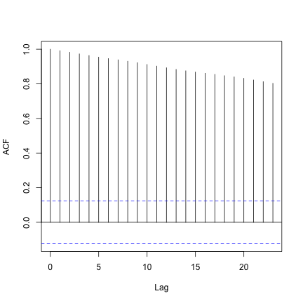
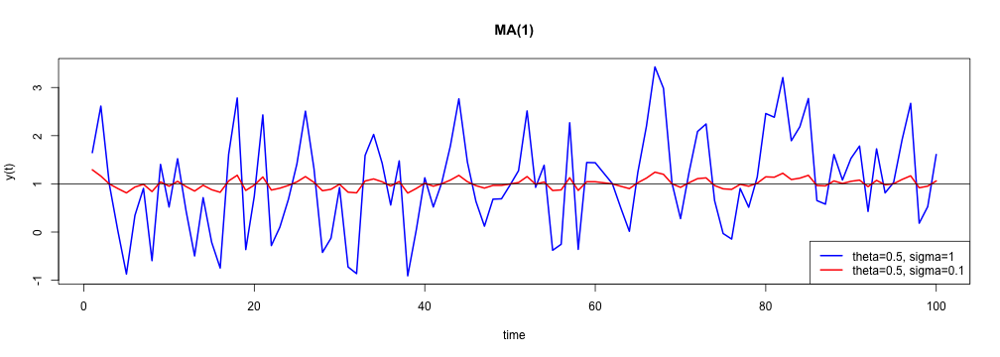
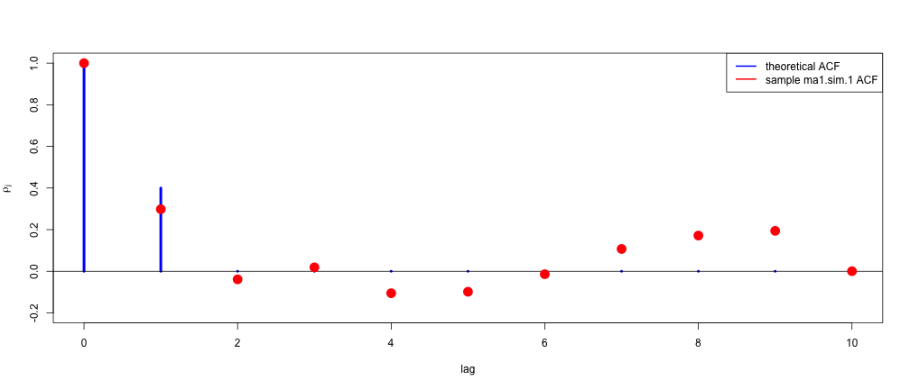
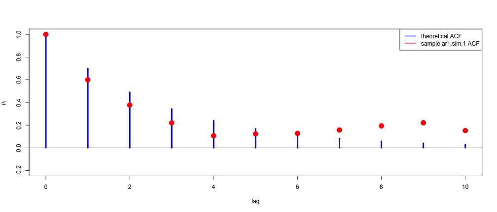

---

title       : Simulando séries temporais lineares  
subtitle    :   
author      : Wilson Freitas  
job         : Quant  
framework   : io2012  
highlighter : highlight.js  
hitheme     : tomorrow  
widgets     : [mathjax]  
mode        : selfcontained  

---

## download de recursos

- [index.Rmd](index.Rmd): código fonte da apresentação

---

## ruído branco Gaussiano

Um ruído branco é uma sequência de variáveis aleatórias independentes e identicamente distribuídas (iid) com média e variância finitas. Se a sequência tem distribuição normal com média zero e variância $\sigma^2$ temos uma série de ruídos brancos Gaussianos.

$$ Y_t \sim iid\,N(0, \sigma^2)\,\, \forall\,\, t $$

$$ \mathbb{E}[Y_tY_s] = 0 \,\, \forall\,\, t \neq s $$

```{r, echo=FALSE}
set.seed(123456789)
```
```{r}
y = rnorm(100)
```
```{r, echo=FALSE}
head(y)
```

---

## ruído branco Gaussiano

```{r whitenoise, include=FALSE}
plot(y, type="l", xlab="t", ylab=expression(Y[t]), col="blue", lwd=2)
abline(h=c(0, -1, 1), lwd=2,
	lty=c("solid", "dotted", "dotted"), 
	col=c("black", "red", "red"))
```
```{r whitenoise-acf, include=FALSE, fig.width=6, fig.height=6}
acf(y, lag.max=10, type="correlation", main="")
```

<p style="text-align:center;">


</p>

<!-- <table>
<tr>
<th>Ruído branco</th><th>Autocorrelação</th>
</tr>
<tr>
<td></td>
<td></td>
</tr>
</table> -->

---

## random walk process

Uma série temporal ${y_t}$ é um *random walk* se satisfaz

$$y_t = y_{t-1} + \varepsilon_t$$
$$ \varepsilon_t \sim iid\, N(0, \sigma^2)\,\, \forall \,\, t $$
$$ \mathrm{E}\left[ \varepsilon_t\varepsilon_s \right] = 0,\,\, \forall \,\, t \neq s  $$

onde $p_0$ é o valor inicial da série.

```{r, echo=FALSE}
set.seed(123456789)
```
```{r}
e = c(100, rnorm(250)) # p_0 = 100
y.rw = cumsum(e)
```
```{r, echo=FALSE}
head(y.rw)
```

---

## random walk process

```{r random-walk, include=FALSE}
plot(y.rw, type="l", lwd=2, col="blue", main="Random Walk")
```
```{r random-walk-acf, include=FALSE, fig.width=6, fig.height=6}
acf(y.rw, type="correlation", main="")
```

<p style="text-align:center;">
	
	
</p>

--- &smaller

## simulando MA(1)

Uma série temporal MA(1) satisfaz

$$y_t = \mu + \varepsilon_t - \theta\varepsilon_{t-1},\,\, \varepsilon_t \sim iid\, N(0,\sigma^2)$$

```{r, echo=FALSE}
set.seed(123456789)
```
```{r}
# theta = 0.5, sigma = 1
ma1.model = list(ma=0.5)
mu = 1
ma1.sim.1 = mu + arima.sim(model=ma1.model, n=100)
```
```{r ma1-sim-1, include=FALSE, fig.width=14, fig.height=4}
plot(ma1.sim.1, type="l", main="MA(1)", xlab="t", ylab=expression(y[t]), col="blue", lwd=2)
abline(h=1)
```
<p style="text-align:center;">

</p>


---

## simulando MA(1)

```{r, echo=FALSE}
set.seed(123456789)
```
```{r}
# theta = 0.5, sigma = 0.1
ma1.model = list(ma=0.5)
mu = 1
ma1.sim.2 = mu + arima.sim(model=ma1.model, n=100, innov=rnorm(n=100, mean=0, sd=0.1))
```
```{r ma1-sim-2, include=FALSE, fig.width=14, fig.height=5}
plot(ma1.sim.1, type="l", main="MA(1)", xlab="time", ylab="y(t)", col="blue", lwd=2)
lines(ma1.sim.2, col="red", lwd=2)
legend(x="bottomright", legend=c("theta=0.5, sigma=1", "theta=0.5, sigma=0.1"), lty=1, lwd=2, col=c("blue","red"))
abline(h=1)
```
<p style="text-align:center;">

</p>

---

## MA(1) autocorrelation function

```{r}
ma1.acf = ARMAacf(ar=0, ma=0.5, lag.max=10)
```
```{r ma1-acf, include=FALSE, fig.width=14, fig.height=6}
plot(0:10, ma1.acf, type="h", col="blue", lwd=4, main="", xlab="lag", ylab=expression(rho[j]), ylim=c(-0.2,1))
abline(h=0)
ma1.sim.1.acf = acf(ma1.sim.1, type="correlation", plot=FALSE)
points(ma1.sim.1.acf$lag, ma1.sim.1.acf$acf, pch=16, col="red", cex=2)
legend(x="topright", legend=c("theoretical ACF", "sample ma1.sim.1 ACF"), lty=1, lwd=2, col=c("blue","red"))
```
<p style="text-align:center;">

</p>

--- &smaller

## simulando AR(1)

Uma série temporal AR(1) satisfaz

$$y_t = \mu + \phi y_{t-1} + \varepsilon_t,\,\, \varepsilon_t \sim iid\,N(0,\sigma^2)$$

```{r, echo=FALSE}
set.seed(123456789)
```
```{r}
# phi = 0.7, sigma = 1
ar1.model = list(ar=0.7)
mu = 1
ar1.sim.1 = mu + arima.sim(model=ar1.model, n=100, innov=rnorm(n=100, mean=0, sd=1))
```
```{r ar1-sim-1, include=FALSE, fig.width=14, fig.height=4}
plot(ar1.sim.1, type="l", main="AR(1)", xlab="t", ylab=expression(y[t]), col="blue", lwd=2)
abline(h=1)
```
<p style="text-align:center;">

</p>

---

## simulando AR(1)

```{r, echo=FALSE}
set.seed(123456789)
```
```{r}
# phi = 0.7, sigma = 0.1
ar1.model = list(ar=0.7)
mu = 1
ar1.sim.2 = mu + arima.sim(model=ar1.model, n=100, innov=rnorm(n=100, mean=0, sd=0.1))
```
```{r ar1-sim-2, include=FALSE, fig.width=14, fig.height=5}
plot(ar1.sim.1, type="l", main="AR(1)", xlab="time", ylab=expression(y[t]), col="blue", lwd=2)
lines(ar1.sim.2, col="red", lwd=2)
legend(x="bottomright", legend=c("phi=0.7, sigma=1", "phi=0.7, sigma=0.1"), lty=1, lwd=2, col=c("blue","red"))
abline(h=1)
```
<p style="text-align:center;">

</p>

---

## AR(1) autocorrelation function

```{r}
ar1.acf = ARMAacf(ar=0.7, ma=0, lag.max=10)
```
```{r ar1-acf, include=FALSE, fig.width=14, fig.height=6}
plot(0:10, ar1.acf, type="h", col="blue", lwd=4, main="", xlab="lag", ylab=expression(rho[j]), ylim=c(-0.2,1))
abline(h=0)
ar1.sim.1.acf = acf(ar1.sim.1, type="correlation", plot=FALSE)
points(ar1.sim.1.acf$lag, ar1.sim.1.acf$acf, pch=16, col="red", cex=2)
legend(x="topright", legend=c("theoretical ACF", "sample ar1.sim.1 ACF"), lty=1, lwd=2, col=c("blue","red"))
```
<p style="text-align:center;">

</p>

--- &thanks
## Simulando séries temporais lineares