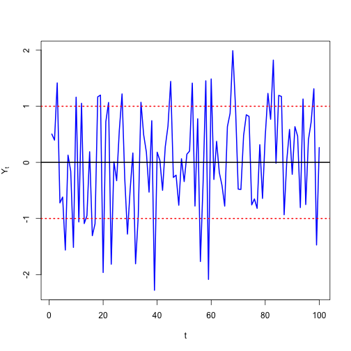
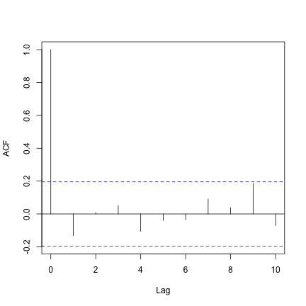
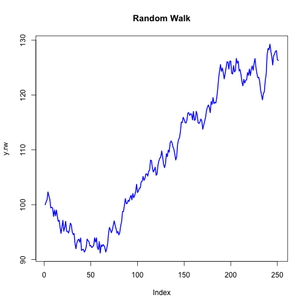
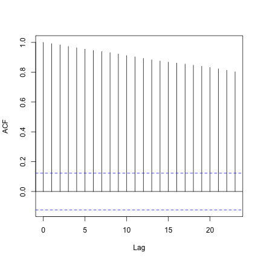
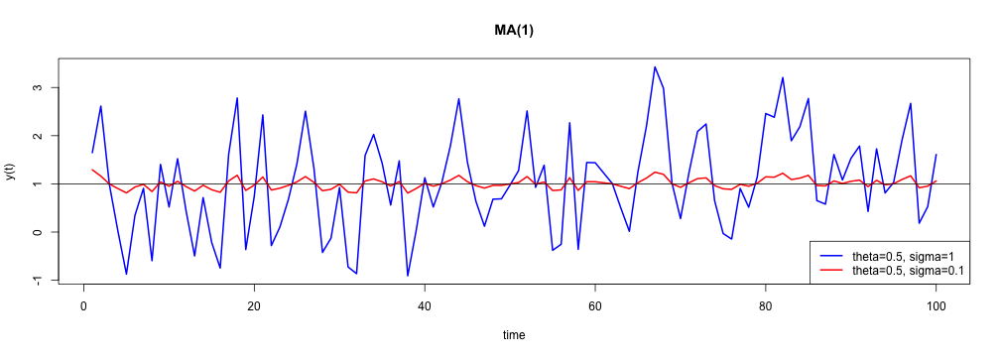
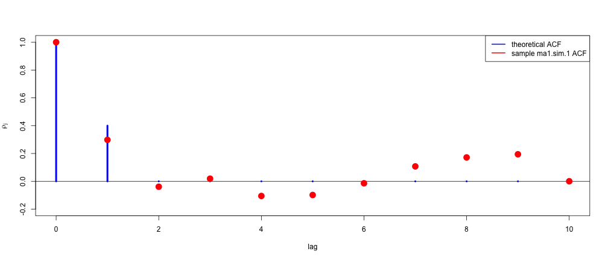
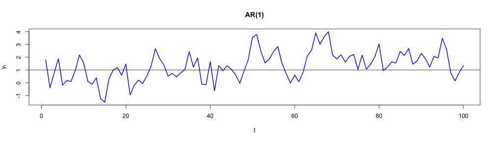
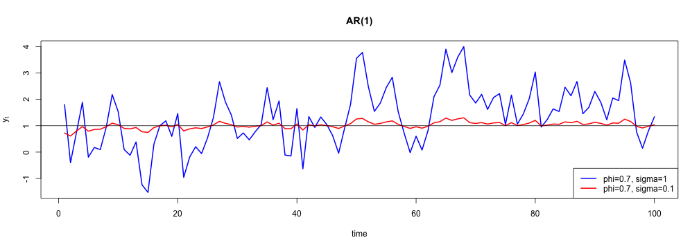
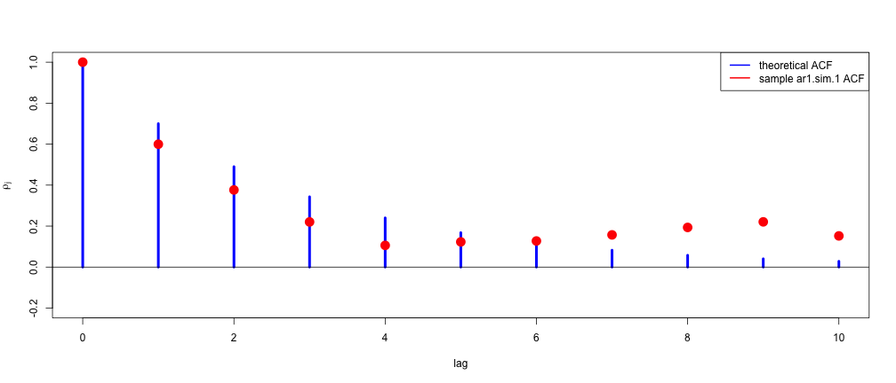

---

title       : Simulando séries temporais lineares  
subtitle    :   
author      : Wilson Freitas  
job         : Quant  
framework   : io2012  
highlighter : highlight.js  
hitheme     : tomorrow  
widgets     : [mathjax]  
mode        : selfcontained  

---

## download de recursos

- [index.Rmd](index.Rmd): código fonte da apresentação

---

## ruído branco Gaussiano

Um ruído branco é uma sequência de variáveis aleatórias independentes e identicamente distribuídas (iid) com média e variância finitas. Se a sequência tem distribuição normal com média zero e variância $\sigma^2$ temos uma série de ruídos brancos Gaussianos.

$$ Y_t \sim iid\,N(0, \sigma^2)\,\, \forall\,\, t $$

$$ \mathbb{E}[Y_tY_s] = 0 \,\, \forall\,\, t \neq s $$


```r
y = rnorm(100)
```


```
## [1]  0.5049  0.3959  1.4155 -0.7223 -0.6184 -1.5626
```


---

## ruído branco Gaussiano


<p style="text-align:center;">


</p>

<!-- <table>
<tr>
<th>Ruído branco</th><th>Autocorrelação</th>
</tr>
<tr>
<td></td>
<td></td>
</tr>
</table> -->

---

## random walk process

Uma série temporal ${y_t}$ é um *random walk* se satisfaz

$$y_t = y_{t-1} + \varepsilon_t$$
$$ \varepsilon_t \sim iid\, N(0, \sigma^2)\,\, \forall \,\, t $$
$$ \mathrm{E}\left[ \varepsilon_t\varepsilon_s \right] = 0,\,\, \forall \,\, t \neq s  $$

onde $p_0$ é o valor inicial da série.


```r
e = c(100, rnorm(250))  # p_0 = 100
y.rw = cumsum(e)
```


```
## [1] 100.0 100.5 100.9 102.3 101.6 101.0
```


---

## random walk process


<p style="text-align:center;">
	
	
</p>

--- &smaller

## simulando MA(1)

Uma série temporal MA(1) satisfaz

$$y_t = \mu + \varepsilon_t - \theta\varepsilon_{t-1},\,\, \varepsilon_t \sim iid\, N(0,\sigma^2)$$


```r
# theta = 0.5, sigma = 1
ma1.model = list(ma = 0.5)
mu = 1
ma1.sim.1 = mu + arima.sim(model = ma1.model, n = 100)
```


<p style="text-align:center;">

</p>


---

## simulando MA(1)


```r
# theta = 0.5, sigma = 0.1
ma1.model = list(ma = 0.5)
mu = 1
ma1.sim.2 = mu + arima.sim(model = ma1.model, n = 100, innov = rnorm(n = 100, 
    mean = 0, sd = 0.1))
```


<p style="text-align:center;">

</p>

---

## MA(1) autocorrelation function


```r
ma1.acf = ARMAacf(ar = 0, ma = 0.5, lag.max = 10)
```


<p style="text-align:center;">

</p>

--- &smaller

## simulando AR(1)

Uma série temporal AR(1) satisfaz

$$y_t = \mu + \phi y_{t-1} + \varepsilon_t,\,\, \varepsilon_t \sim iid\,N(0,\sigma^2)$$


```r
# phi = 0.7, sigma = 1
ar1.model = list(ar = 0.7)
mu = 1
ar1.sim.1 = mu + arima.sim(model = ar1.model, n = 100, innov = rnorm(n = 100, 
    mean = 0, sd = 1))
```


<p style="text-align:center;">

</p>

---

## simulando AR(1)


```r
# phi = 0.7, sigma = 0.1
ar1.model = list(ar = 0.7)
mu = 1
ar1.sim.2 = mu + arima.sim(model = ar1.model, n = 100, innov = rnorm(n = 100, 
    mean = 0, sd = 0.1))
```


<p style="text-align:center;">

</p>

---

## AR(1) autocorrelation function


```r
ar1.acf = ARMAacf(ar = 0.7, ma = 0, lag.max = 10)
```


<p style="text-align:center;">

</p>

--- &thanks
## Simulando séries temporais lineares
