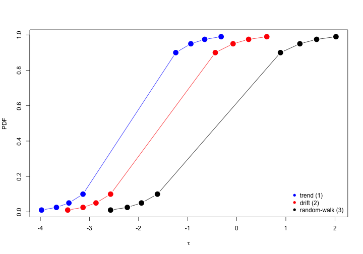

---

title       : Testes de raiz unitária  
subtitle    : Avaliando estacionariedade em séries temporais financeiras  
author      : Wilson Freitas  
job         : Quant  
framework   : io2012        # {io2012, html5slides, shower, dzslides, ...}  
highlighter : highlight.js  # {highlight.js, prettify, highlight}  
hitheme     : tomorrow      #   
widgets     : [mathjax]     # {mathjax, quiz, bootstrap}  
mode        : selfcontained # {standalone, draft}  

name		: Wilson Freitas  
company		: Quant Developer  
gplus		: https://plus.google.com/u/0/114469936125336696794
twitter		: @aboutwilson
www			: http://www.aboutwilson.net/trading-strategies/
github		: https://github.com/wilsonfreitas

---


## Recursos

- [index.Rmd](index.Rmd)


--- .segue .dark .nobackground
## Testes de Raiz Unitária

---

## Definição do teste de raiz unitária

Existem diversos testes de raiz unitária (RU)

1. Augmented Dickey-Fuller (ADF)
1. Phillips-Perron (PP)
1. Kwiatkowski-Phillips-Schmidt-Shin (KPSS)
1. ...

Na maioria dos testes a hipótese nula é de que a série tenha raiz unitária, e portanto não seja estacionária, logo:
$$
\begin{split}
H_0: & \textrm{tem raiz unitária (não é estacionária)}\\
H_1: & \textrm{não tem raiz unitária (é estacionária)}
\end{split}
$$

**No teste KPSS a hipótese nula é de que não existe raiz unitária.**

--- &smaller

## Implementando o teste de raiz unitária

Temos uma série temporal $y_t$ e desejamos estimar o seguinte modelo para esta série:

$$
y_t = \phi y_{t-1} + \varepsilon_t
$$

que claramente é um AR(1) e está sujeito a 

$$
\varepsilon_t \sim iid\, N(0, \sigma^2)\,\, \forall \,\, t \\
\mathrm{E}\left[ \varepsilon_t\varepsilon_s \right] = 0,\,\, \forall \,\, t \neq s
$$

Para que $y_t$ seja estacionário temos que obter $\phi$ que atenda a restrição $|\phi| < 1$.
Logo, as hipóteses do teste devem reescritas como:

$$
\begin{split}
H_0: & \phi = 1,\, y_t \textrm{ não é estacionário}\\
H_1: & |\phi| < 1,\, y_t \textrm{ é estacionário}
\end{split}
$$

<div class="centered red3" style="margin-top: 2em;">
	Testar a estacionariedade $\longrightarrow$ teste-$t$ sobre $\hat{\phi}$
</div>

--- &smaller

No entanto, é mais comum testar se os coeficientes são nulos de forma que uma simples transformação no modelo nos leva a

$$
\Delta y_t = (\phi - 1) y_{t-1} + \varepsilon_t = \pi\, y_{t-1} + \varepsilon_t
$$

e consequentemente novas hipóteses

$$
\begin{split}
H_0: & \pi = 0,\, y_t \textrm{ não é estacionário}\\
H_1: & \pi < 0,\, y_t \textrm{ é estacionário}
\end{split}
$$

<div class="red3 centered"  style="margin-top: 2em; margin-bottom: 2em;">
	Esta abordagem é utilizada no teste ADF.
</div>

Infelizmente, na prática a teoria é outra de forma que nem sempre é possível utilizar apenas um AR(1) para identificar a existência de raiz unitária.
Algumas séries possuem uma estrutura mais complexa e um simples AR(1) não é suficiente para capturá-la.

Veremos a seguir como os testes ADF e PP contornam este problema.

--- .segue .dark .nobackground
## Testes de Dickey-Fuller

--- &smaller
## Testes de Dickey-Fuller

Segundo Dickey-Fuller, devem ser consideradas 3 abordagens para realizar o teste de raiz unitária (considerando $H_0: \pi = 0$).

##### Random-walk com drift e tendência deterministica
$$
\Delta Z_t = \beta_0 + \beta_1 t + \pi Z_{t-1} + \sum_{i=1}^{p-1} \delta_i \Delta Z_{t-i} + \varepsilon_t
$$

##### Random-walk com drift
$$
\Delta Z_t = \beta_0 + \pi Z_{t-1} + \sum_{i=1}^{p-1} \delta_i \Delta Z_{t-i} + \varepsilon_t
$$

##### Random-walk plain-vanilla
$$
\Delta Z_t = \pi Z_{t-1} + \sum_{i=1}^{p-1} \delta_i \Delta Z_{t-i} + \varepsilon_t
$$

--- &smaller

- A estrutura do AR(1) foi extendida para acomodar uma estrutura ARMA(p,q) mais geral.
- Essa extenção é conhecida como augmented Dickey-Fuller (ADF).
- O teste considerando apenas o modelo AR(1) é o teste de Dickey-Fuller padrão que pode ser tratado como uma caso particular do teste ADF quando $p=1$.
- A estatística de interesse é
$$
\tau_i = \frac{\hat{\phi}-1}{S_{\hat{\phi}}}
$$
onde $i=1,2,3$ representam os modelos propostos.
- Note que apesar do teste de RU ter uma *jeitão* de teste-$t$, na prática não é, pois a distribuição de $\tau_i$ não é uma $t$ de Student.
- Cada modelo proposto possui uma distribuição para $\tau_i$.
- As distribuições para $\tau_i$ são obtidas através de simulações de Monte-Carlo (MacKinnon 1996).

---
- O gráfico abaixo apresenta os p-valores da estatística $\tau_i$.


<p style="text-align:center;">
	
</p>

--- .segue .dark .nobackground
## Teste ADF no R

--- &smaller
O teste ADF no R está na função `ur.df` do pacote [`urca`](http://cran.r-project.org/web/packages/urca/) implementado por [Bernhard Pfaff](http://www.pfaffikus.de/) autor do livro [Analysis of Integrated and Cointegrated Time Series with R (Use R!)](http://www.amazon.com/Analysis-Integrated-Cointegrated-Time-Series/dp/0387759662/ref=sr_1_1?ie=UTF8&qid=1354657433&sr=8-1&keywords=Bernhard+Pfaff).


```r
args(ur.df)
```

```
## function (y, type = c("none", "drift", "trend"), lags = 1, selectlags = c("Fixed", 
##     "AIC", "BIC")) 
## NULL
```

- `type` recebe o modelo a ser considerado na realização do teste. `none` define o modelo random-walk plain-vanilla e os demais parâmetros são auto-explicativos.
- `selectlags` define qual o critério será utilizado para a seleção do modelo estimado. `Fixed` é o padrão de forma que o modelo é estimado com os `lags` fornecidos e não há seleção de modelo.
- `lags` define a quantidade de lags a ser utilizada na estimação da parte ARMA(p,q) do modelo. Este parâmetro deve ser utilizado em conjunto com o parâmetro `selectlags`. Se `selectlags` for `AIC` ou `BIC` o valor de `lags` é a quantidade máxima de parâmetros que um modelo poderá possuir. Logo, na dúvida chute um número razoável para `lags` e reze, porque a partir daqui já virou uma questão de fé.

--- &smaller


Vamos aplicar o teste ADF a série diária do log do BOVESPA para o ano de 2011.
Note que a série claramente apresenta uma tendência de queda, e isto para mim são bons indícios de que o modelo com tendência deterministica seja adequado para realizar o teste de RU.


<p style="text-align:center;">
	
</p>

--- &smaller

Começemos com `type="trend"`, `lags=4` e `selectlags="BIC"` e soca a bota.


```r
library(urca)
ur <- ur.df(y = BVSP.price, lags = 4, type = "trend", selectlags = "BIC")
ur@testreg
```

```
## 
## Call:
## lm(formula = z.diff ~ z.lag.1 + 1 + tt + z.diff.lag)
## 
## Residuals:
##      Min       1Q   Median       3Q      Max 
## -0.08919 -0.00895  0.00070  0.00934  0.03885 
## 
## Coefficients:
##              Estimate Std. Error t value Pr(>|t|)  
## (Intercept)  5.51e-01   2.38e-01    2.31    0.022 *
## z.lag.1     -4.95e-02   2.14e-02   -2.32    0.021 *
## tt          -4.65e-05   2.74e-05   -1.70    0.091 .
## z.diff.lag  -2.18e-02   6.47e-02   -0.34    0.736  
## ---
## Signif. codes:  0 '***' 0.001 '**' 0.01 '*' 0.05 '.' 0.1 ' ' 1 
## 
## Residual standard error: 0.0156 on 240 degrees of freedom
## Multiple R-squared: 0.0252,	Adjusted R-squared: 0.013 
## F-statistic: 2.07 on 3 and 240 DF,  p-value: 0.105
```


--- &smaller
### Conclusões

- O modelo selecionado foi `lm(formula = z.diff ~ z.lag.1 + 1 + tt + z.diff.lag)` com `lags=1`, mesmo fornecendo `lags=4`
- O coeficiente da tendência `tt` é negativo mantendo a coerência com o gráfico.
- O coeficiente `z.lag.1`, parâmetro de interesse para o teste de raiz unitária e para avaliar a sua insignificância precisamos da tabela de valores críticos que fica na variável `ur@cval` do teste.

```
##       1pct  5pct 10pct
## tau3 -3.99 -3.43 -3.13
## phi2  6.22  4.75  4.07
## phi3  8.43  6.49  5.47
```

- `tau3` é a estatística referente ao coeficiente `z.lag.1` e estes são os dados que interessam, a informação de significância da tabela `Coefficients` refere-se ao teste-$t$.
Na mesma tabela temos que o valor da estatistíca para `z.lag.1` é -2.32 e avaliando os níveis críticos de `tau3` concluímos que não é possível rejeitar a hipótese nula para `z.lag.1` e, portanto, a série tem raiz unitária e é não-estacionária.

--- &vcenter
### Ahhh ... os resíduos
É importante, obviamente, dar uma olhada nos resíduos.
A variável `ur@res` contem os resíduos e o comando `plot(ur)` gera o gráfico abaixo.

 


---
### Sanity-check

- Apenas para ter certeza de que as coisas funcionam como deveriam funcionar vamos realizar o teste ADF com um random-walk gerado.
- Vamos usar `type="none"`, pois o random-walk foi gerado sem drift e sem tendência deterministica.


```r
ur <- ur.df(y = cumsum(c(100, rnorm(250))), lags = 4, type = "none", selectlags = "BIC")
```


Os resultados estão no próximo slide.

---


```
## 
## Call:
## lm(formula = z.diff ~ z.lag.1 - 1 + z.diff.lag)
## 
## Residuals:
##    Min     1Q Median     3Q    Max 
## -2.320 -0.647 -0.111  0.599  3.184 
## 
## Coefficients:
##             Estimate Std. Error t value Pr(>|t|)
## z.lag.1    -0.000165   0.000593   -0.28     0.78
## z.diff.lag -0.058213   0.063937   -0.91     0.36
## 
## Residual standard error: 0.944 on 244 degrees of freedom
## Multiple R-squared: 0.00368,	Adjusted R-squared: -0.00448 
## F-statistic: 0.451 on 2 and 244 DF,  p-value: 0.638
```


---
### Conclusões
- O valor da estatística de interesse é -0.28.
- Os valores críticos para o teste são

```
##       1pct  5pct 10pct
## tau1 -2.58 -1.95 -1.62
```

- Note que `tau1` é a variável de interesse, pois refere-se ao modelo random-walk plain-vanilla e os seus valores críticos são diferentes daqueles obtidos no teste com a série do Bovespa onde a variável era `tau3`.
- Não rejeitamos a hipótese nula e portanto:
	- <span class="red3">A série tem raiz unitária</span>
	- A série é não-estacionária

--- &thanks
## Testes de raiz unitária

